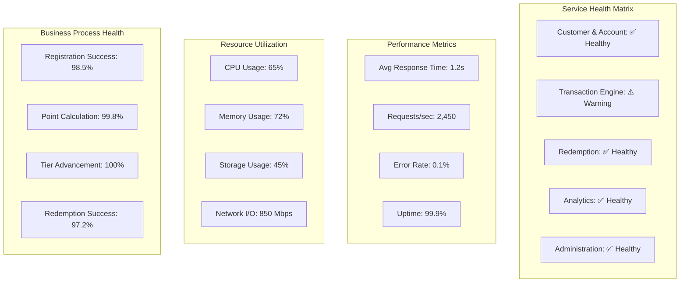

# Monitoring Dashboard Specifications

## Executive Business Dashboard (General Manager View)

```mermaid
dashboard
    title "PremiumCard Loyalty Program - Executive Dashboard"
    
    section "Key Performance Indicators"
        customerActivation : 0 : 75%
        transactionGrowth : 0 : 25%
        categoryPenetration : 0 : 60%
        redemptionRate : 0 : 35%
        customerSatisfaction : 0 : 4.5
        churnReduction : 0 : 30%
        
    section "Real-Time Metrics"
        activeCustomers : 0 : 15420
        dailyTransactions : 0 : 8750
        pointsEarned : 0 : 2.3M
        pointsRedeemed : 0 : 890K
        
    section "Revenue Impact"
        transactionVolume : 0 : $2.8M
        avgTransactionSize : 0 : $127
        tierDistribution : 0 : "Bronze: 60%, Silver: 25%, Gold: 12%, Platinum: 3%"
        
    section "System Health"
        systemUptime : 0 : 99.9%
        apiResponseTime : 0 : 1.2s
        errorRate : 0 : 0.1%
```

## Operational Dashboard (Sales Rep View)

```mermaid
dashboard
    title "Customer Support & Operations Dashboard"
    
    section "Support Metrics"
        openTickets : 0 : 23
        avgResolutionTime : 0 : "2.5 hours"
        customerSatisfactionScore : 0 : 4.6
        
    section "Customer Activity"
        newRegistrations : 0 : 145
        tierAdvancements : 0 : 12
        redemptionRequests : 0 : 67
        
    section "Issue Tracking"
        pointAdjustments : 0 : 8
        escalatedIssues : 0 : 3
        systemAlerts : 0 : 1
        
    section "Performance"
        callsHandled : 0 : 89
        emailsProcessed : 0 : 156
        chatSessions : 0 : 234
```

## Technical Operations Dashboard



## Alert Configuration Matrix

| Alert Type | Severity | Threshold | Response Time | Notification |
|------------|----------|-----------|---------------|--------------|
| **Critical Business Alerts** |
| Payment Gateway Down | Critical | 0 failures | Immediate | SMS + Email + Slack |
| Point Calculation Error | Critical | >1% error rate | Immediate | SMS + Email + Slack |
| Customer Data Breach | Critical | Any occurrence | Immediate | SMS + Email + Phone |
| **Warning Alerts** |
| High Transaction Latency | Warning | >5s response | 15 minutes | Email + Slack |
| Low Redemption Success | Warning | <95% success | 30 minutes | Email |
| Tier Advancement Failure | Warning | Any failure | 15 minutes | Email + Slack |
| **Info Alerts** |
| High Registration Volume | Info | >200/hour | 1 hour | Email |
| Unusual Spending Pattern | Info | Statistical anomaly | 4 hours | Email |
| Partner Service Degradation | Info | >3s response | 30 minutes | Email |

## Business-Friendly Log Examples

### Customer & Account Management Logs
```
✅ SUCCESS: Customer "Sarah Johnson" registered successfully - assigned Bronze tier
ℹ️  INFO: Customer completed onboarding tutorial in 4 minutes 32 seconds
⚠️  WARNING: Customer attempted to update invalid email format
❌ ERROR: Registration failed - duplicate email address detected
```

### Transaction & Rewards Engine Logs
```
✅ SUCCESS: Customer earned 300 points from $100 dining purchase (3x multiplier applied)
🎉 MILESTONE: Customer "John Smith" advanced from Silver to Gold tier after $15,000 spending
⚠️  WARNING: Payment gateway response time exceeded 3 seconds
❌ ERROR: Point calculation failed - invalid merchant category code
```

### Redemption & Fulfillment Logs
```
✅ SUCCESS: Customer redeemed 25,000 points for $250 cashback - processed in 45 seconds
🎫 BOOKING: Travel reservation confirmed - Flight to NYC for 50,000 points
📦 SHIPPING: Merchandise order #12345 shipped via FedEx - tracking: 1Z999AA1234567890
❌ ERROR: Experience booking failed - Spa appointment unavailable for selected date
```

### Analytics & Engagement Logs
```
📊 INSIGHT: Customer viewed spending dashboard - total spending $2,847 this month
💡 RECOMMENDATION: Suggested using travel category for 2x points (customer books flights monthly)
🏆 ACHIEVEMENT: Customer completed "Dining Explorer" challenge - earned 1,000 bonus points
📱 SOCIAL: Customer shared Gold tier achievement on Facebook - 23 likes received
```

### Administration & Operations Logs
```
⚙️  CONFIG: GM updated dining category multiplier from 2x to 3x effective immediately
💰 CREDIT: Sales rep issued 5,000 point credit to customer for service recovery
📈 REPORT: Monthly business report generated - 25% increase in transaction volume
📞 SUPPORT: Customer issue resolved in 1.5 hours - satisfaction rating: 5/5
```

## Monitoring Integration Points

### Real-Time Dashboards
- **Grafana** for technical metrics visualization
- **Tableau** for business intelligence dashboards
- **Custom React Dashboard** for customer-facing metrics

### Log Management
- **ELK Stack** (Elasticsearch, Logstash, Kibana) for log aggregation
- **Structured JSON logging** with business-friendly message fields
- **Log correlation** across microservices using trace IDs

### Alerting Systems
- **PagerDuty** for critical incident management
- **Slack** for team notifications
- **Email** for business stakeholder updates
- **SMS** for emergency alerts

### Metrics Collection
- **Prometheus** for technical metrics
- **Custom business metrics** API for KPI tracking
- **Application Performance Monitoring** (APM) tools
- **Synthetic monitoring** for end-to-end business process validation