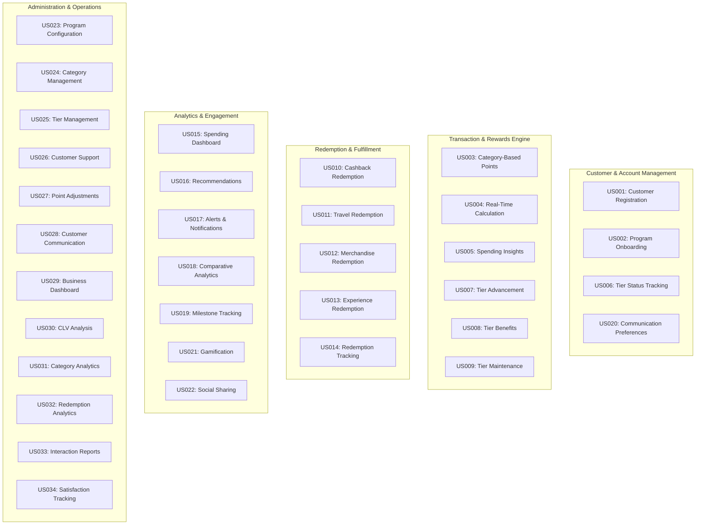
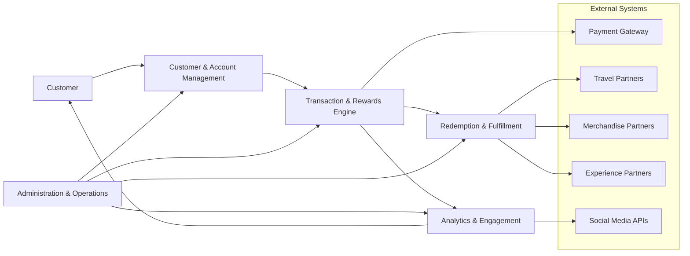
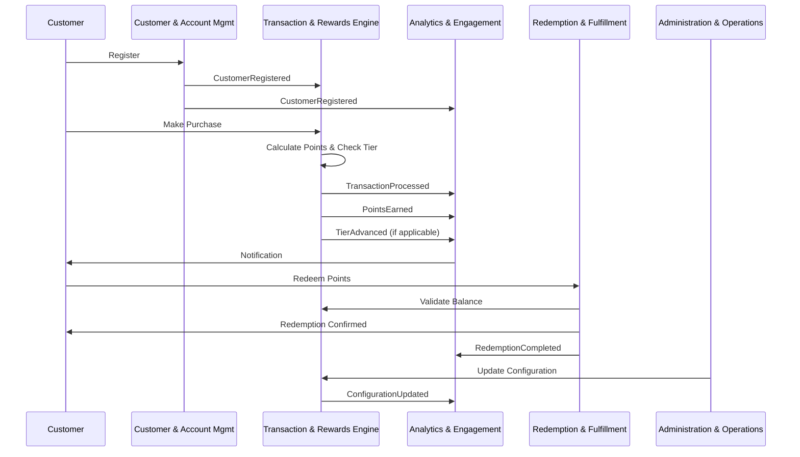
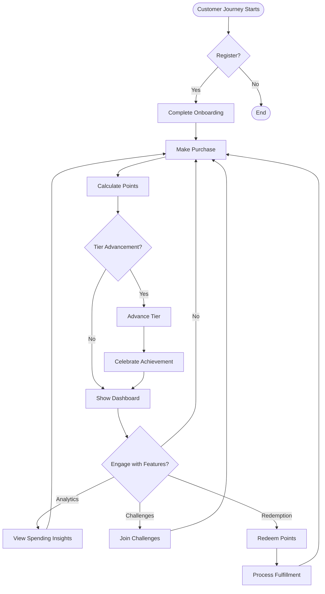
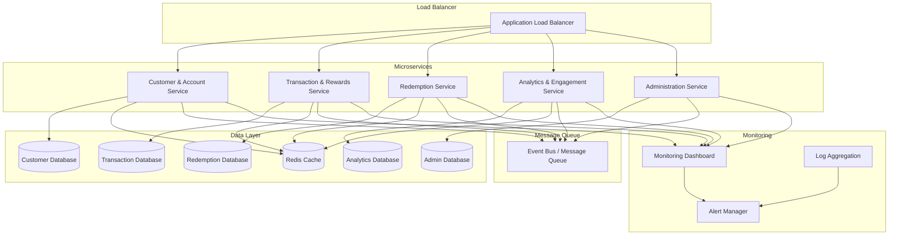

# System Visualization - PremiumCard Loyalty & Rewards Program

## Unit Architecture Overview

## Data Flow Architecture

## Event-Driven Communication

## Business Process Flow

## System Health Monitoring

```mermaid
graph TB
    subgraph "Monitoring Stack"
        Metrics[Business Metrics]
        Logs[Application Logs]
        Traces[Distributed Tracing]
        Alerts[Alert Management]
    end
    
    subgraph "Unit 1: Customer & Account"
        CAM_Health[Health Checks]
        CAM_Metrics[Registration Rate<br/>Onboarding Success<br/>Profile Updates]
        CAM_Logs[Business-Friendly Logs<br/>'Customer John registered'<br/>'Onboarding completed']
    end
    
    subgraph "Unit 2: Transaction & Rewards"
        TRE_Health[Health Checks]
        TRE_Metrics[Transaction Rate<br/>Point Accuracy<br/>Tier Advancements]
        TRE_Logs[Business-Friendly Logs<br/>'Earned 150 points'<br/>'Advanced to Gold tier']
    end
    
    subgraph "Unit 3: Redemption"
        RF_Health[Health Checks]
        RF_Metrics[Redemption Success<br/>Processing Time<br/>Partner Response]
        RF_Logs[Business-Friendly Logs<br/>'Redeemed for cashback'<br/>'Travel booking confirmed']
    end
    
    subgraph "Unit 4: Analytics & Engagement"
        AE_Health[Health Checks]
        AE_Metrics[Dashboard Usage<br/>Recommendation CTR<br/>Challenge Completion]
        AE_Logs[Business-Friendly Logs<br/>'Dashboard viewed'<br/>'Challenge completed']
    end
    
    subgraph "Unit 5: Administration"
        AO_Health[Health Checks]
        AO_Metrics[Support Resolution<br/>Config Changes<br/>Report Generation]
        AO_Logs[Business-Friendly Logs<br/>'Multiplier updated'<br/>'Credit issued']
    end
    
    CAM_Health --> Metrics
    CAM_Metrics --> Metrics
    CAM_Logs --> Logs
    
    TRE_Health --> Metrics
    TRE_Metrics --> Metrics
    TRE_Logs --> Logs
    
    RF_Health --> Metrics
    RF_Metrics --> Metrics
    RF_Logs --> Logs
    
    AE_Health --> Metrics
    AE_Metrics --> Metrics
    AE_Logs --> Logs
    
    AO_Health --> Metrics
    AO_Metrics --> Metrics
    AO_Logs --> Logs
    
    Metrics --> Alerts
    Logs --> Alerts
    Traces --> Alerts
```

## Deployment Architecture

